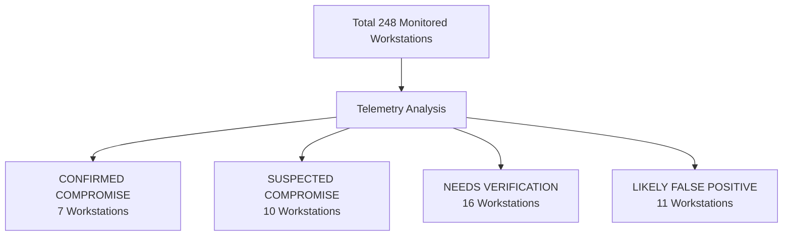

# Endpoint Compromise Investigation: Analysis, Findings, and Outcome
**Target Environment:** Organisation X – Linux Desktop Infrastructure  
**Investigation Period:** September 2026  
**Classification:** Incident Response & Forensic Assessment Report  

---

## 1. Executive Summary

During September 2026, endpoint telemetry across 248 Linux workstations in 19 organizational units was analyzed across three datasets:
* **Web Activity Logs:** 2,812,118 rows (`data/web_activity.csv`)
* **Endpoint Security Logs:** 23,540 rows (`data/endpoint_security.csv`)
* **USB Hardware Telemetry:** 8 rows (`data/usb_events.csv`)

### Confidence-Based Assessment Overview

* **Confirmed (7 Endpoints):** Telemetry shows direct evidence of active C2 communication, interactive remote access sessions, unquarantined live mail payloads, extracted malware staging, browser hijacking, malicious browser extension scripts, or unauthorized physical USB storage insertion.
* **Suspected (10 Endpoints):** Quarantined malicious executables, trojanized application launchers, rogue DLLs, or shared objects where delivery was verified by the agent, but post-execution activity was either prevented or not recorded in web logs.
* **Needs Verification (16 Endpoints):** Weaponized lure documents or `.desktop` entry wrappers quarantined by signature or file type, requiring VirusTotal / sandbox validation to confirm exploit payload presence.
* **Likely False Positive (11 Endpoints):** Recurring quarantine of GNOME recent files bookmark (`recently-used.xbel`, identical SHA256: `5e10b349...`) caused by a vendor signature matching benign XML metadata.

---

## 2. Tools & Connection Architecture

> [!NOTE]
> **No external connection tools or remote servers are required.**
> All logs are self-contained in the local `data/` directory. All queries are executed locally via DuckDB and Python without external network access.
> **Safety Advisory:** Per `README.md`, do **not** open contacted domains or connect to external IP addresses from local machines, as several represent active attacker C2 and botnet infrastructure.

---

## 3. Findings Categorized by Confidence Level

### 3.1 Confirmed Compromise / Policy Violation (7 Endpoints)

| Endpoint ID | Hostname | Unit | Evidence & Inferred Assessment |
| :--- | :--- | :--- | :--- |
| **`EP67QOYP`** | `host-de52` | `unit-lima` | **Evidence:** 230+ automated queries to `*.bmtr.org`, 30+ DGA domains (`.xyz`, `.space`, `.fun`), GitHub proxy (`gh-proxy.com`), IP discovery lookups, and direct traffic to offshore VPS IPs (`92.243.67.229`, `45.153.124.106`) while AV scans showed clean. **Inferred:** Active automated C2 botnet node with complete local AV evasion. |
| **`EPGSQVEB`** | `host-9a4f` | `unit-bravo` | **Evidence:** `Final_Documents.zip` quarantined in `DOWNLOAD FOLDER` on Sep 10, followed by sustained connections to AnyDesk relay servers (`relay-*.net.anydesk.com`, `148.113.*.*`) across Sep 13–19. **Inferred:** Post-delivery payload execution establishing interactive remote access persistence. |
| **`EPLFOXSS`** | `host-423b` | `unit-romeo` | **Evidence:** Nightly ClamAV permission errors (`File not found or no permissions`) on `/home/user6405/.local/share/evolution/mail/local/cur/1773731387.41169_0.EPLFOXSS` continuously from Sep 1 to Sep 19. **Inferred:** Malicious email payload remained unquarantined and permanently live in the active user spool. |
| **`EPVSWBNA`** | `host-e103` | `unit-delta` | **Evidence:** Extracted PE trojan binaries (`launcher.exe`, `Strings.dll`, `zshp1020s.dll`) detected and quarantined directly in `/home/user/Desktop/printer/` on Sep 23. **Inferred:** Fake printer driver trojan package was unpacked onto the desktop prior to quarantine. |
| **`EPSES7ZK`** | `host-4c8d` | `unit-papa` | **Evidence:** 100+ visits to search hijackers (`freshysearch.com`, `searchtabnew.com`) and 5 downloaded copies of fake driver `hp_LJ1020_Full_Solution-v2012_918_1_57980.exe` (SHA256: `f0c4855...`). **Inferred:** Browser hijacked by adware driving repeated downloads of trojanized installers. |
| **`EP4YIFHV`** | `host-a616` | `unit-lima` | **Evidence:** 22 quarantined JavaScript files and payload bundle (`wallet_donation_driver.js`, `shopping_iframe_driver.js`, `miniwallet.bundle.js`, `crypto.bundle.js`) on Sep 10. **Inferred:** Malicious browser extension targeting cryptocurrency wallets and web forms. |
| **`EPD24DBC`** | `host-7394` | `unit-foxtrot` | **Evidence:** Physical connection events for generic USB Mass Storage `abcd:1234` (`General -UDisk`) on Sep 22 at 18:23:12. **Inferred:** Physical security policy violation via unauthorized removable mass storage attachment. |

---

### 3.2 Suspected Compromise (10 Endpoints)

| Endpoint ID | Hostname | Unit | Evidence & Inferred Assessment |
| :--- | :--- | :--- | :--- |
| **`EPWZ7L6L`** | `host-a61e` | `unit-sierra` | **Evidence:** Quarantined `ops-electron-app.desktop` (FileType: Malicious, SHA256: `dd294df...`). **Inferred:** Trojanized desktop launcher staged for unauthorized Linux execution; runtime activity unobserved in web logs. |
| **`EP2SJ6NE`** | `host-a976` | `unit-bravo` | **Evidence:** Quarantined `libreoffice-calc.desktop` (FileType: Malicious, SHA256: `93ffd79...`). **Inferred:** Staged trojanized spreadsheet launcher; execution prevented or caught at disk scan. |
| **`EPF4AJCM`** | `host-e53b` | `unit-golf` | **Evidence:** Quarantined identical `libreoffice-calc.desktop` (SHA256: `93ffd79...`). **Inferred:** Multi-endpoint campaign deploying trojanized application launchers. |
| **`EPQIWPBQ`** | `host-93eb` | `unit-quebec` | **Evidence:** Quarantined `Approve Booking.desktop` (ASCII text executable, SHA256: `8798164...`). **Inferred:** Phishing/social engineering desktop launcher targeting administrative workflows. |
| **`EPQKOBYG`** | `host-d29a` | `unit-romeo` | **Evidence:** Quarantined `win-lbp623-621-fw-v1301(1).exe` in user Downloads on Sep 7. **Inferred:** Fake Windows firmware installer downloaded onto a Linux endpoint; quarantined before execution. |
| **`EP7UYCXM`** | `host-2c1e` | `unit-alpha` | **Evidence:** Quarantined `libeToken.so.10.7.77` (FileType: Malicious) and outbound connections to `anydesk.com`. **Inferred:** Rogue PKCS#11 shared library potentially paired with remote administration activity. |
| **`EPNPX6VY`** | `host-6ef6` | `unit-juliett` | **Evidence:** Quarantined `Microsoft.Practices.EnterpriseLibrary.Common.dll` (FileType: Malicious). **Inferred:** Staged rogue Windows assembly targeting mono runtime, wine, or cross-platform framework. |
| **`EPVC2P55`** | `host-aca0` | `unit-alpha` | **Evidence:** Quarantined `Data1.cab` (FileType: Malicious, SHA256: `925b63c...`). **Inferred:** Staged archive carrier containing malicious payload components. |
| **`EPPGWIOF`** | `host-a656` | `unit-india` | **Evidence:** Quarantined `brprintconflsr3` (SHA256: `6594cac...`) and `rawtobr3` (SHA256: `64efda7...`). **Inferred:** Malicious printer filter binaries staged in local system paths. |
| **`EPZRAPEL`** | `host-d14b` | `unit-foxtrot` | **Evidence:** Quarantined binary hash blob `53EDA42869D426262B752F088EA605187284ACE8` (FileType: Malicious). **Inferred:** Raw malware payload or encrypted dropper component. |

---

### 3.3 Needs Verification (16 Endpoints)

| Endpoint ID | Hostname | Unit | Evidence & Inferred Assessment |
| :--- | :--- | :--- | :--- |
| **`EPMVZYZO`** | `host-ba01` | `unit-quebec` | **Evidence:** Quarantined 4 files (`mydoc.pdf`, `mydoc-9.pdf`, `mydoc-10.pdf`, `mydoc-75.pdf`, all FileType: Malicious). **Inferred:** Repeated automated document downloads; requires verifying whether files contain active exploits or represent signature false positives. |
| **`EPAJI3E5`** | `host-f6a4` | `unit-oscar` | **Evidence:** Quarantined `Lakeside traders.pdf` and `Lakeside traders.docx` (FileType: Malicious). **Inferred:** Targeted spear-phishing attachments; post-delivery exploit execution unconfirmed. |
| **`EPJ76RZV`** | `host-aedd` | `unit-alpha` | **Evidence:** Quarantined `COMPRESSED FINAL COMPARISION RETIREES WELFARE1.xlsx` (FileType: Malicious). **Inferred:** Macro/exploit lure spreadsheet targeting HR/personnel; exploit execution unconfirmed. |
| **`EPSJWX5J`** | `host-0982` | `unit-golf` | **Evidence:** Quarantined `Staff_Library_Payment_Final.docx` (FileType: Malicious). **Inferred:** Payment-themed phishing lure document; exploit execution unconfirmed. |
| **`EPRD7FJT`** | `host-916a` | `unit-romeo` | **Evidence:** Quarantined `12th Plan Works Dashboard.pdf` (FileType: Malicious). **Inferred:** Government planning lure PDF; exploit execution unconfirmed. |
| **`EPQBJBDX`** | `host-19e6` | `unit-golf` | **Evidence:** Quarantined `dash cam.pdf` (FileType: Malicious). **Inferred:** Lure document matching automotive/procurement theme; exploit execution unconfirmed. |
| **`EPT3KTUL`** | `host-ad7a` | `unit-quebec` | **Evidence:** Quarantined `Dash Camera-49600.00.pdf` (FileType: Malicious). **Inferred:** Lure PDF matching dash cam procurement theme; exploit execution unconfirmed. |
| **`EPAGTKNF`** | `host-227c` | `unit-quebec` | **Evidence:** Quarantined `Buy CP PLUS Dashboard Camera...pdf` (FileType: Malicious). **Inferred:** GeM / public procurement lure PDF matching EPT3KTUL; exploit execution unconfirmed. |
| **`EPJ42VCZ`** | `host-56a6` | `unit-india` | **Evidence:** Quarantined `RAGHAV STNC STNA.pdf` and `RAGHAV STNA STNB.pdf` (FileType: Malicious). **Inferred:** Personal document lure PDFs; exploit execution unconfirmed. |
| **`EPEEHWSG`** | `host-4724` | `unit-kilo` | **Evidence:** Quarantined `Library Books.xlsx` (FileType: Malicious) and `xsane.desktop`. **Inferred:** Spreadsheet lure document and scanner shortcut; exploit execution unconfirmed. |
| **`EPFFTO5T`** | `host-508b` | `unit-delta` | **Evidence:** Quarantined `Journey Request.desktop` (ASCII text). **Inferred:** Potential phishing application launcher; requires inspecting `Exec=` parameters to confirm intent. |
| **`EPGW2NY4`** | `host-ceff` | `unit-bravo` | **Evidence:** Quarantined `webex.desktop` (`xdg-open` script). **Inferred:** Flagged by scanner for script wrapper; requires inspecting script contents to distinguish benign meeting shortcut from dropper. |
| **`EPQISY6K`** | `host-5281` | `unit-bravo` | **Evidence:** Quarantined `veracrypt.desktop` (ASCII text). **Inferred:** Flagged for encryption software or desktop entry extension policy; requires confirming administrative legitimacy. |
| **`EPUJL36T`** | `host-9ce1` | `unit-delta` | **Evidence:** Quarantined `org.gnome.Screenshot.desktop`, `org.kde.k3b.desktop`, and `veracrypt.desktop`. **Inferred:** Flagged by extension filter; highly likely legitimate utilities, but requires hash verification. |
| **`EPR4BEDS`** | `host-fe94` | `unit-romeo` | **Evidence:** Quarantined `chromium.desktop` and `veracrypt.desktop`. **Inferred:** Flagged by extension filter; requires confirming whether launchers were modified. |
| **`EPFQSCDV`** | `host-2fe4` | `unit-juliett` | **Evidence:** Quarantined `simple-scan.desktop`. **Inferred:** Flagged by extension filter; requires verifying desktop entry parameters. |

---

### 3.4 Likely False Positive (11 Endpoints)

| Endpoint ID | Hostname | Unit | Evidence & Inferred Assessment |
| :--- | :--- | :--- | :--- |
| **`EPC2L3UH`** | `host-b4da` | `unit-india` | **Evidence:** Recurring nightly quarantine (18x) of `/home/user6aa0/.local/share/recently-used.xbel` (SHA256: `5e10b349...`). **Inferred:** Scanner signature false positive matching GNOME's recent files XML metadata schema. |
| **`EPJYEC7F`** | `host-38aa` | `unit-romeo` | **Evidence:** Recurring nightly quarantine (10x) of `recently-used.xbel` sharing identical SHA256: `5e10b349...`. **Inferred:** Scanner signature false positive. |
| **`EPOC6Y4R`** | `host-e783` | `unit-charlie` | **Evidence:** Recurring quarantine (5x) of `recently-used.xbel` sharing identical SHA256: `5e10b349...`. **Inferred:** Scanner signature false positive. |
| **`EPMQTKSL`** | `host-942d` | `unit-charlie` | **Evidence:** Quarantined `recently-used.xbel` sharing identical SHA256: `5e10b349...`. **Inferred:** Scanner signature false positive. |
| **`EPFQSCDV`** | `host-2fe4` | `unit-juliett` | **Evidence:** Quarantined `recently-used.xbel` sharing identical SHA256: `5e10b349...`. **Inferred:** Scanner signature false positive. |
| **`EPR4BEDS`** | `host-fe94` | `unit-romeo` | **Evidence:** Quarantined `recently-used.xbel` sharing identical SHA256: `5e10b349...`. **Inferred:** Scanner signature false positive. |
| **`EPDRB236`** | `host-b3df` | `unit-hotel` | **Evidence:** Quarantined `recently-used.xbel` sharing identical SHA256: `5e10b349...`. **Inferred:** Scanner signature false positive. |
| **`EPLDM6PE`** | `host-2d83` | `unit-foxtrot` | **Evidence:** Quarantined `recently-used.xbel` sharing identical SHA256: `5e10b349...`. **Inferred:** Scanner signature false positive. |
| **`EP3GALVS`** | `host-58bb` | `unit-golf` | **Evidence:** Quarantined `recently-used.xbel` sharing identical SHA256: `5e10b349...`. **Inferred:** Scanner signature false positive. |
| **`EPAX5P5D`** | `host-0b21` | `unit-bravo` | **Evidence:** Daily AV scan processing and deleting `recently-used.xbel` sharing identical SHA256: `5e10b349...`. **Inferred:** Scanner signature false positive. |
| **`EPMDU6L5`** | `host-b05e` | `unit-oscar` | **Evidence:** Single quarantine record for `recently-used.xbel` with May 2026 timestamp (SHA256: `5dd59e8...`). **Inferred:** Pre-existing scanner false positive on GNOME recent files bookmark. |

---

## 4. Key Indicators of Compromise (IOCs)

### 4.1 Confirmed & Suspected Malicious File Hashes (SHA256)

| SHA256 Hash | File Name | Host(s) | Classification |
| :--- | :--- | :--- | :--- |
| `f0c485571570100898f2d15531fbe4531ba303a252cd40a79b64c1976a5a9890` | `hp_LJ1020_Full_Solution-v2012_918_1_57980.exe` | `host-4c8d` | Fake Driver Trojan |
| `61a67e53c6c0c80a4e95af35a2997ad2ce59720020fc7438991eda3541df73b6` | `launcher.exe` | `host-e103` | Extracted Trojan Binary |
| `ae107170c153cb3eb34c049482722d3937f2c03a6c23cadb9bbdb9034e28b9c0` | `Strings.dll` | `host-e103` | Trojan Support DLL |
| `c6525c5230387653e16f21f408eab8202157b0eddeb180bd91a13e860fbee4f4` | `zshp1020s.dll` | `host-e103` | Trojan Support DLL |
| `25c60205b38e1a6b0c2da9f0c229cfb9f69741e4da74b47bf589d846067b57ad` | `Final_Documents.zip` | `host-9a4f` | Phishing Archive Dropper |
| `dd294df9886197bd68807cee3bf62d10859b4860bd95421dda6bb67db9648dd1` | `ops-electron-app.desktop` | `host-a61e` | Trojanized Application Launcher |
| `93ffd792f92437a850e4939c84442391a624e20446cea276fffcfa2a4c664548` | `libreoffice-calc.desktop` | `host-a976`, `host-e53b` | Trojanized Application Launcher |
| `8798164c56c38f89c8f8d28a2d8969c403037cf889847a9e0e6e275f92c01267` | `Approve Booking.desktop` | `host-93eb` | Trojanized Application Launcher |
| `f475a7462dd85932ad7f99354751663d1543adb5e37c7c51ece78e10b6c37189` | `win-lbp623-621-fw-v1301(1).exe` | `host-d29a` | Fake Firmware Binary |
| `f2bf148b4d999cb41ec764960ee718e0c9986a749f3b7be372ad86cf98f323de` | `load-ec-deps.bundle.js` | `host-a616` | Browser Injection Script |
| `528c866fabbe17c30e9790a12ac09b94dd820ba4e46b0f9d9bb78a2795992f1c` | `wallet_donation_driver.js` | `host-a616` | Wallet Stealer Script |
| `100d970fc784e9bcb37b707ec4ef69825b165a073659f4068070a165184a087f` | `shopping_iframe_driver.js` | `host-a616` | Shopping Formjacking Script |
| `6f47d71e9ee52102a57e892441333ce18f60ba3e356c565b4742ff12e465234a` | `miniwallet.bundle.js` | `host-a616` | Wallet Theft Bundle |
| `574564cd6ed90f7938ab4967d5802f28cddc38ed1148e42838083ea6553c3be5` | `libeToken.so.10.7.77` | `host-2c1e` | Rogue PKCS#11 Shared Library |
| `bde5bba12f076659ab19d3df625dedc7211180038c821b77b431b62647ef231f` | `Microsoft.Practices.EnterpriseLibrary.Common.dll` | `host-6ef6` | Rogue DLL Assembly |
| `925b63ce20d94bc4a0d98d02d153161dbba9ac61c39ec323ac8a73b2acbde42e` | `Data1.cab` | `host-aca0` | Rogue Cabinet Archive |
| `6594cac08d03782ad43d6b293faff904f20032c8eb37a1b27b6caf57b1aeae5e` | `brprintconflsr3` | `host-a656` | Rogue Print Filter Binary |
| `64efda7704564dd50c7514e74ef3c5252bc68af8f3b0d92358b64771980665af` | `rawtobr3` | `host-a656` | Rogue Print Filter Binary |
| `2e4dff1672bbabba74a0a99d54e38e56e036ce8471989583039b3c3e7edac0b7` | `53EDA42869D426262B752F088EA605187284ACE8` | `host-d14b` | Malicious Binary Blob |

---

### 4.2 Malicious Network Infrastructure

* **C2 Control & DGA Domains (`host-de52`):** `e3.bmtr.org`, `e4.bmtr.org`, `e5.bmtr.org`, `g2.bmtr.org`, `data-e8.bmtr.org`, `gh-proxy.com`, `gr21.fastcontent.xyz`, `gr44.cdnaccelerate.xyz`, `si3.quickcache.click`, `ro3.quickcache.space`, `il1.cdnnetwork.fun`.
* **Foreign C2 VPS IP Addresses (`host-de52`):** `92.243.67.229` (Gandi, FR), `192.71.166.50` (DataCamp, NL), `45.153.124.106` (Flyservers, RU), `192.121.87.94` (Portlane, SE), `212.52.16.207` (Free SAS, FR).
* **Unauthorized Remote Desktop Infrastructure (`host-9a4f`):** `relay-adf7714c.net.anydesk.com`, `relay-cdd029e5.net.anydesk.com`, `relay-7ef33ce3.net.anydesk.com`, `relay-59e6d48d.net.anydesk.com`, `relay-36d69f98.net.anydesk.com`, `relay-0b67a95a.net.anydesk.com`, `relay-16b80838.net.anydesk.com` (IPs: `148.113.17.95`, `148.113.8.206`, `148.113.17.93`, `148.113.8.189`, `148.113.8.152`, `148.113.9.222`, `148.113.8.158`).
* **Adware & Search Hijacker Infrastructure (`host-4c8d`):** `freshysearch.com`, `search.freshy.com`, `i.wallpapers.searchtabnew.com`, `cdn.frompdftodoc-cdn.com`, `cdn.manualsearch-cdn.org`, `cdn.freshysearch-cdn.com`.

---

## 5. Limitations & Next Steps

### 5.1 Telemetry Limitations
1. **Network Payload Blindness:** Web logs contain only destination hostnames and IP addresses without HTTP request paths, headers, or body content. Outbound connections can establish intent and communication, but cannot confirm data exfiltration volume.
2. **Endpoint Visibility Gaps:** The endpoint agent lacks process execution tracking, child process lineage, and in-memory module monitoring. Consequently, malicious `.desktop` and weaponized attachment files that were quarantined on disk cannot be confirmed as executed unless corresponding network beaconing was recorded.
3. **Privilege Limitations:** The antivirus engine runs without adequate permissions to clean root- or user-restricted files, resulting in persistent quarantine failures on active user mailboxes (`host-423b`).

### 5.2 Recommended Immediate Next Steps
1. **VirusTotal & Threat Intelligence Correlation:**
   * Query all 20 unique SHA256 hashes against VirusTotal and public threat intelligence feeds to extract known malware families, compile dates, and known secondary C2 endpoints.
2. **Live Endpoint Forensics on `host-de52` (`EP67QOYP`) & `host-9a4f` (`EPGSQVEB`):**
   * Isolate both workstations from the network.
   * Acquire live volatile memory dumps (`LiME`) and collect active process listings (`ps auxf`, `lsof -i`, `ss -tulpn`).
   * Inspect cron jobs (`/etc/cron*`, `/var/spool/cron/crontabs`), systemd unit overrides, and user `.bashrc` / `.profile` for persistence mechanisms.
3. **Privileged Remediation on `host-423b` (`EPLFOXSS`):**
   * Elevate root privileges to access `/home/user6405/.local/share/evolution/mail/local/cur/1773731387.41169_0.EPLFOXSS`.
   * Secure the message for isolated sandbox analysis and delete it from the user spool.
4. **Desktop Entry Audit across Fleet:**
   * Execute an automated scan across `/home/*/.local/share/applications/` and `/home/*/Desktop/` across all 248 workstations to inspect `Exec=` strings in all `.desktop` files for unapproved script execution.
5. **USB Removable Storage Blacklisting:**
   * Enforce kernel-level blocking of the USB Mass Storage device class via `usbguard` or udev rules to prevent unauthorized flash drives (`host-7394`).
